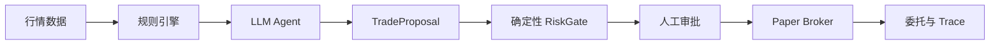

# AI Trader

> 面向 A 股模拟交易的受约束 Agent 决策系统

AI Trader 将规则引擎、LLM 分析、RAG 历史经验、风险管理和模拟交易执行组合为一条可观察的决策链路。项目正在向生产级 Agent Runtime 演进：Agent 负责收集证据和生成交易提案，确定性风控和审批边界负责决定提案能否执行。

> [!WARNING]
> 本项目是工程学习和模拟交易原型，不构成投资建议。真实交易默认关闭，离线 Demo 只使用内存 Paper Broker。

## 为什么采用混合架构

全市场数据先由确定性规则引擎筛选，只将少量候选标的交给 LLM 分析。这会显著减少模型调用量和等待时间，但对决策质量的影响仍需通过离线 Agent Evals 和回测验证。



## 当前能力

- Rule Engine 技术指标筛选；
- ReAct 风格的工具规划与 14 个行情、持仓、RAG 和通知工具；
- 历史预测记录与 ChromaDB 语义检索；
- FastAPI 仪表盘、飞书通知和 Windows 模拟交易自动化；
- 不可变 `TradeProposal`、风控决策和委托契约；
- 独立于 LLM 的 Kill Switch、行情时效、仓位、现金和重复委托检查；
- 幂等 Paper Broker 与无网络离线演示。
- Pydantic 强类型 Tool Runtime，支持权限、逐调用审批、超时和结构化错误；
- 提供方无关的 Model Gateway，统一结构化工具调用、token 用量、重试和 fallback。
- SQLite + SQLAlchemy 任务快照和追加式 Trace，支持乐观并发控制、取消和重启恢复；
- Trace 在仓库写入边界强制脱敏，避免 API Key、Bearer Token 和 Webhook 进入审计数据。
- FastAPI 控制面提供任务、Trace、提案和审批接口，不暴露直接买卖端点；
- 执行协调器将审批绑定到具体提案，在 Broker 副作用前事务性保留幂等键；
- 同花顺 Adapter 默认禁用并延迟导入，GUI 提交只记为已受理，不伪报为已成交。
- 32 个版本化 Agent Eval 场景，覆盖工具、参数、风控、幂等、审批、恢复和 Prompt Injection；
- 稳定的 JSON/Markdown 评测报告，包含工具选择、参数、策略合规、结果、恢复、步数效率和有据性。
- 官方 Anthropic Python SDK Provider，支持结构化工具、prompt caching、缓存 token 计量和统一错误映射；
- 旧版行情、持仓和 RAG 能力的懒加载只读适配，不向模型暴露买卖或通知工具；
- 新持久化 Agent Runner 为显式启用，旧版流水线仍作为默认回滚路径。

## 经验记忆系统（RAG 架构决策）

本项目的经验记忆层经历过一次**测量驱动的架构决策**：从向量 RAG 重构为 TradingAgents 式结构化日志（`experience_log.py`）。

**决策依据**（全部实测）：

| 实验 | 结果 |
|------|------|
| 语料同质性 | 132 条分析文档两两余弦相似度均值 0.84，并查集聚类（0.9 阈值）后仅 6 个语义簇 |
| 向量 RAG 优化上限 | 换 embedding / 混合检索 / 语料重写（729 条多风格重生成）后召回最高 25%，不可用 |
| 场景需求分析 | 经验检索是强规则问题：同股票历史+时间序+自带盈亏结果，非语义匹配问题 |

**现行方案**：

- **两阶段生命周期**：决策先入 `pending`，收盘复盘回填真实涨跌后转 `resolved`——只有带结果的经验才有资格注入分析 prompt
- **规则注入**：同股票最近 5 条完整决策（含真实结果）+ 跨股票 3 条教训（截断防膨胀）
- **时间点过滤**：`as_of` 参数保证回测不使用未来才揭晓的结果（防未来函数/look-ahead bias）
- **反思闭环**：每日自动对已验证决策生成 2-4 句反思（方向判断/论证失效环节/下次教训），幂等指纹防重复

详见 `experience_log.py`（<300 行自研，参照 [TradingAgents](https://github.com/TauricResearch/TradingAgents) 记忆机制设计）。

## 安全离线演示

离线演示不需要 API Key、实时行情、同花顺或模型权重。

```powershell
# Windows：显式选择受支持的 Python，避免 PATH 中的 MSYS Python
py -3.13 -m pip install -e ".[test]"
py -3.13 -m pytest
py -3.13 -m ai_trader.demo
# 结构化 Agent 工具调用演示
py -3.13 -m ai_trader.demo --agent
# 持久化任务重启恢复演示
py -3.13 -m ai_trader.demo --recovery
# 32 场景确定性 Eval 契约基线
py -3.13 -m ai_trader.demo --evals
# 生成 JSON 和 Markdown 报告
py -3.13 -m ai_trader.evals.cli --dataset evals/scenarios/core.json --output evals/reports
# 新 Runtime 的无网络、无交易 dry-run
py -3.13 -m ai_trader.runtime --dry-run
# 完整离线验收
powershell -ExecutionPolicy Bypass -File scripts/preflight.ps1
```

预期演示输出：

```text
proposal=proposal-demo-001
risk_outcome=require_human
order=paper-demo-001
status=filled
live_execution=false
```

## 生产化路线

| 阶段 | 状态 | 交付物 |
|---|---|---|
| Phase 1 | 已完成 | 安全配置、领域契约、RiskGate、Paper Broker |
| Phase 2 | 已完成 | Structured Tool Runtime 与 Model Gateway |
| Phase 3 | 已完成 | 持久化状态机、Trace、取消与恢复 |
| Phase 4 | 已完成 | 审批 API、幂等执行、委托状态确认 |
| Phase 5 | 已完成 | 32 个 Agent Eval 场景、指标报告与只读摘要 API |

## Agent Evals

`evals/scenarios/core.json` 是可版本化的安全与可靠性数据集。评分维度为：

| 指标 | 含义 |
|---|---|
| Tool selection | 必需工具是否被调用 |
| Argument accuracy | 关键参数是否正确 |
| Policy compliance | 是否调用禁止工具 |
| Outcome accuracy | 最终状态是否符合预期 |
| Recovery | 需恢复的场景是否恢复 |
| Step efficiency | 是否在最大步数内完成 |
| Groundedness | 结论是否引用必需证据 |

> [!IMPORTANT]
> 默认 `ExpectedTraceExecutor` 只验证数据集、评分器和报告的确定性合同，其 100% 结果不代表真实模型质量。要比较真实模型，必须实现 `ScenarioExecutor` 并保留实际轨迹。

## 新 Runtime 迁移入口

默认 `AI_TRADER_RUNTIME_MODE=legacy`，不会改变原有调度入口。新 Runtime 需要显式配置：

```dotenv
AI_TRADER_RUNTIME_MODE=production
AI_TRADER_AGENT_MODE=production
ANTHROPIC_AUTH_TOKEN=your_api_key_here
ANTHROPIC_BASE_URL=https://token-plan-cn.xiaomimimo.com/anthropic
ANTHROPIC_MODEL=mimo-v2-pro
RUNTIME_DATABASE_URL=sqlite:///data/agent_runtime.db
```

新入口通过官方 Anthropic SDK 访问 Messages API。SDK 内部重试关闭，由 Model Gateway 统一决定重试与 fallback；稳定的工具 Schema 按名称排序并使用 ephemeral prompt cache。

现有调度器支持三种模式：

| `AI_TRADER_AGENT_MODE` | 行为 |
|---|---|
| `pipeline` | 原固定流水线（默认回滚路径） |
| `agent` | 原文本 ReAct Agent |
| `production` | 新持久化、只读 Tool Runtime |

在线 smoke test 会发生一次真实 API 请求，只能显式执行：

```powershell
py -3.13 -m ai_trader.runtime --smoke-online --allow-network
```

本命令不包含任何交易工具，但会产生模型 API 调用和可能的费用。

完整设计见 [生产级 Agent Runtime 设计](docs/superpowers/specs/2026-07-11-production-agent-runtime-design.md)。

## 旧版应用模块

| 模块 | 职责 |
|---|---|
| `main.py` | 定时调度和旧版分析流水线 |
| `agent_planner.py` | ReAct 风格的 Agent 循环 |
| `agent_tools.py` | 工具注册与调用 |
| `strategy.py` | 技术信号与仓位规则 |
| `rag_store.py` | 历史经验检索 |
| `ths_trader.py` | 默认不安全启用的 Windows GUI 模拟交易原型 |

## License

MIT
