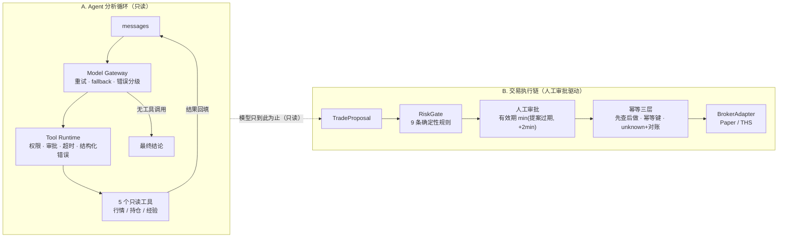

# AI Trader

> 面向 A 股模拟交易的**受约束 Agent 决策系统**：LLM 只负责收集证据、生成提案；提案能否执行，由确定性风控与人工审批决定。

**一句话**：**LLM 建议 → 风控门裁决 → 人工审批 → 幂等执行 → 全程可审计。**

> [!WARNING]
> 本项目是工程学习与模拟交易原型，**不构成投资建议**。真实交易默认关闭；离线 Demo 只使用内存 Paper Broker。

---

## 30 秒速览（给面试官）

| 关注点 | 本项目怎么做 |
|---|---|
| **LLM 能做什么** | Agent **只有只读工具**（行情 / 大盘 / 技术指标 / 持仓 / 历史经验，共 5 个）。模型产出的是 `TradeProposal`——一个**纯数据对象，无任何副作用** |
| **LLM 不能做什么** | 不能下单。`ToolEffect.WRITE` / `HIGH_RISK` 与 `requires_approval` 机制已实现，但**生产装配里没有注册任何写工具**（刻意的安全边界） |
| **谁能真正下单** | 只有 `ExecutionCoordinator`，且必须**同时**满足：人工审批仍有效 + 风控门二次放行 + 幂等键事务性保留成功 |
| **风控是否会放水** | 不会。`RiskGate` 是**纯确定性规则**（9 条），完全不依赖模型，模型无法绕过 |
| **跑一半崩了** | 状态与事件都落库（追加式）。`recoverable_runs()` 能捞出所有非终态任务 |
| **会不会重复下单** | 幂等三层：先查后做 → `reserve_order` 幂等键 → 失败标 `unknown` 留 `reconcile` 对账 |
| **并发改同一条数据** | 乐观锁（`expected_version` → `VersionConflict`）：不加锁、不阻塞，适合低频状态转移 |
| **怎么证明它是对的** | **101 项测试 / 覆盖 86.69% / CI 7 步全绿 / 4 条零依赖离线 Demo** |

---

## 架构


```mermaid
flowchart LR
    subgraph A["A. Agent 分析循环（只读）"]
        MSG["messages"] --> GW["Model Gateway<br/>重试 · fallback · 错误分级"]
        GW --> RT["Tool Runtime<br/>权限 · 审批 · 超时 · 结构化错误"]
        RT --> TOOLS["5 个只读工具<br/>行情 / 持仓 / 经验"]
        TOOLS -->|结果回填| MSG
        GW -->|无工具调用| OUT["最终结论"]
    end
    subgraph B["B. 交易执行链（人工审批驱动）"]
        P["TradeProposal"] --> RISK["RiskGate<br/>9 条确定性规则"]
        RISK --> APP["人工审批<br/>有效期 min(提案过期, +2min)"]
        APP --> IDEM["幂等三层<br/>先查后做 · 幂等键 · unknown+对账"]
        IDEM --> BROKER["BrokerAdapter<br/>Paper / THS"]
    end
    A -.->|"模型只到此为止（只读）"| P
```

**两条链在代码层面是分开的**：Agent 循环不引用 `ExecutionCoordinator`，写路径只能由人工通过 HTTP 控制面发起。这是本项目的核心安全取舍，详见 [已知限制](#已知限制)。

---

## 核心能力

### 新 Runtime（生产路径，默认不启用）

- **领域契约**：`TradeProposal` / `RiskDecision` / `Order` 全部为不可变模型，金额用 `Decimal`，时间强制带时区（naive 直接报错）。
- **确定性风控门**：`RiskGate` 9 条硬规则（交易总开关 / 提案过期 / 行情时效 30s / 标的匹配 / 单一仓位 15% / 持仓只数 8 / 当日亏损 3% / 现金充足 / 重复委托），三态出口 `REJECT` / `REQUIRE_HUMAN` / `APPROVE`。
- **显式状态机**：9 个状态 + 合法转移表；**拒绝非法转移**，也**拒绝时间倒流**。
- **事件溯源 + 乐观并发**：每次转移写一条追加式事件；`expected_version` 冲突抛 `VersionConflict`，且**卡在事务内**。
- **意图先落盘**：进入 `TOOL_RUNNING` / `EXECUTING` 前，先写 `INTENT_RECORDED` 事件。
- **幂等三层**：`get_order_by_proposal` 先查后做 → `reserve_order` 幂等键（`DuplicateReservation`）→ Broker 异常时 `mark_execution_unknown`，由 `reconcile` 向 Broker 对账。
- **模型网关**：Provider 无关；`ProviderErrorCode` 分级决定是否重试（401/403 不重试，429/超时/5xx 重试），支持多 Provider fallback；SDK 内置重试关闭（`max_retries=0`），重试策略统一由网关决定。
- **工具运行时**：6 类结构化错误码（unknown / permission / approval / validation / timeout / handler / output_validation）、入参出参双向校验、线程池隔离超时。
- **可观测**：Trace 在**写入边界强制脱敏**，避免 API Key / Bearer Token / Webhook 进入审计数据。
- **控制面**：FastAPI 提供任务、Trace、提案、审批接口——**不暴露任何直接买卖端点**。
- **离线评测**：32 个版本化 Agent Eval 场景，覆盖工具选择、参数、风控合规、幂等、审批、恢复与 Prompt Injection。

### 旧版流水线（`main.py`，默认回滚路径）

规则引擎筛选 + ReAct 文本 Agent（14 个工具）+ 同花顺 GUI 自动化 + 飞书通知。新 Runtime 通过 `tools/legacy_market.py` 以**懒加载只读**方式复用它的行情/持仓/经验能力，**不向模型暴露任何买卖或通知工具**。

---

## 工程证据（全部可复现）

| 项 | 结果 |
|---|---|
| CI（GitHub Actions，7 步） | ✅ Install / Build / **mypy strict** / **ruff** / **pytest** / dry-run / evals 全绿 |
| 测试 | **101 passed**，覆盖率 **86.69%**（门槛 85%） |
| 类型与静态检查 | `mypy --strict` 39 个源文件零错误；`ruff` 零告警 |
| 离线 Demo | 4 条（交易 / 工具调用 / 崩溃恢复 / 评测），**不联网、不下单、不花钱** |

---

## 安全离线验收

不需要 API Key、实时行情、同花顺或模型权重。

```powershell
# Python 必须落在 3.12 ~ 3.13（pyproject 的 requires-python 排除了 3.14）
py -3.13 -m pip install -e ".[test]"
py -3.13 -m pytest

# 4 条零依赖 Demo
py -3.13 -m ai_trader.demo              # 风控门 + Paper Broker
py -3.13 -m ai_trader.demo --agent      # 结构化工具调用往返
py -3.13 -m ai_trader.demo --recovery   # 持久化任务重启恢复
py -3.13 -m ai_trader.demo --evals      # 32 场景确定性 Eval 契约基线

# 生成 JSON / Markdown 评测报告
py -3.13 -m ai_trader.evals.cli --dataset evals/scenarios/core.json --output evals/reports

# 无网络、无交易的 dry-run
py -3.13 -m ai_trader.runtime --dry-run

# 完整离线验收
powershell -ExecutionPolicy Bypass -File scripts/preflight.ps1
```

预期输出：

```text
proposal=proposal-demo-001
risk_outcome=require_human      # 风控门放行但要求人工审批，而不是自动执行
order=paper-demo-001
status=filled
live_execution=false
```

`--recovery` 演示会创建**两次** repository 实例，中间关掉第一个——即"进程被杀后重启"，重读结果：

```text
recovered_run=run-demo-001
state=planning
version=1
events=2                        # 事件数 ≠ 版本数：create 是 INSERT，其余是 UPDATE
replayed_side_effects=0         # 重放不产生副作用
```

---

## 经验记忆层：一次测量驱动的架构回退

本项目的经验记忆层有过一次**基于测量的架构决策**——从向量 RAG **回退**为结构化日志（`experience_log.py`）。

**决策依据（全部实测）**：

| 实验 | 结果 |
|---|---|
| 语料同质性 | 132 条分析文档两两余弦相似度**均值 0.842**，0.9 阈值并查集聚类后**仅 6 个语义簇** |
| 向量 RAG 优化上限 | 换 embedding / 混合检索 / 语料重写（729 条多风格重生成）后召回最高 **25%**，不可用 |
| 需求分析 | 经验检索本质是**强规则问题**（同标的历史 + 时间序 + 自带盈亏结果），不是语义匹配问题 |

**现行方案**：

- **两阶段生命周期**：决策先入 `pending`，收盘复盘回填真实涨跌后转 `resolved`——**只有带结果的经验才有资格注入 prompt**。
- **分级注入**：同标的最近 5 条完整决策（含真实结果）+ 跨标的 3 条教训。
- **时间点过滤**：`as_of` 参数保证回测不使用未来才揭晓的结果（**防未来函数 / look-ahead bias**）。
- **反思闭环**：每日对已验证决策生成 2–4 句反思，**幂等指纹**防重复。

实现见 `experience_log.py`，参照 [TradingAgents](https://github.com/TauricResearch/TradingAgents) 的记忆机制设计。

> 这是本项目最想展示的一件事：**先量化问题，再决定要不要上组件**——结果是"加了向量 RAG 反而更差"，于是回退。

---

## Agent Evals

`evals/scenarios/core.json` 是可版本化的安全与可靠性数据集，评分维度：

| 指标 | 含义 |
|---|---|
| Tool selection | 必需工具是否被调用 |
| Argument accuracy | 关键参数是否正确 |
| Policy compliance | 是否调用了禁止工具 |
| Outcome accuracy | 最终状态是否符合预期 |
| Recovery | 需要恢复的场景是否真的恢复 |
| Step efficiency | 是否在最大步数内完成 |
| Groundedness | 结论是否引用必需证据 |

> [!IMPORTANT]
> 默认的 `ExpectedTraceExecutor` **只验证数据集、评分器与报告本身的确定性合同**——它的 100% **不代表真实模型质量**。要比较真实模型，必须自行实现 `ScenarioExecutor` 并保留实际轨迹。

---

## 已知限制（主动交底）

这些都是**当前代码的真实状态**，写在 README 里而不是等面试官去发现：

1. **Agent 不能自主下单。** 生产装配的 5 个工具全是只读（`get_quote` / `get_market_overview` / `get_technical_indicators` / `get_positions` / `rag_search`），且 `ExecutionCoordinator` 不在 Agent 的调用链上。因此 `runner.py` 里处理 `APPROVAL_REQUIRED` 的那段分支在当前装配下不会触发。
2. **`EXECUTING` / `VERIFYING` 目前不可达。** 状态机允许这两个转移，但唯一能推进到 `EXECUTING` 的 `resume_approved()` 在生产代码中没有调用者（只有测试）。**"合法转移表"不等于"实现清单"**——这是本项目最值得记录的一条经验。
3. **拒绝审批不会推进 run 状态。** `ExecutionCoordinator.reject()` 只写一条 `ApprovalRecord(approved=False)`，它操作的是 proposals/approvals/orders 三张表；而 `RunState` 在 runs/events 两张表。两套表互不知道，所以**用户拒绝后 run 会停在 `WAITING_APPROVAL`**。
4. **设计文档与实现有落差。** `docs/superpowers/plans/...phase-4.md` 写明 `ExecutionCoordinator` 应 compose `PersistentOrchestrator`，但实现里 `__init__` 没有接。这正好解释了第 2、3 条——执行链不知道 `RunState` 的存在。
5. **真实交易默认关闭**，新 Runtime 也需要显式 `AI_TRADER_RUNTIME_MODE=production` 才启用；默认走旧版流水线。
6. **本机时钟参与风控判定。** `RiskGate` 用本机时钟与行情时间比对 30 秒时效窗口——若本机时钟漂移，所有提案会被 `STALE_QUOTE` 拒绝。
7. **`requires-python` 排除了 3.14**（当前为 `>=3.12,<3.14`），开发机上如果默认是 3.14 会装不上，必须显式指定 3.12/3.13。
8. **HTTP 客户端默认 `trust_env=True`。** 若环境变量 `NO_PROXY` 含"已带方括号的 IPv6"（如 `[::1]`），httpx 会生成畸形模式 `all://*[::1]` 并抛 `InvalidURL`，导致**服务启动即失败**。

> 第 1–4 条构成同一件事：**写路径在设计上完整、在装配上还没接通。** 这是我刻意选择的安全优先顺序——先把只读与审批边界做扎实，再接自动执行。

---

## 生产化路线

| 阶段 | 状态 | 交付物 |
|---|---|---|
| Phase 1 | 已完成 | 安全配置、领域契约、`RiskGate`、Paper Broker |
| Phase 2 | 已完成 | Structured Tool Runtime 与 Model Gateway |
| Phase 3 | 已完成 | 持久化状态机、Trace、取消与恢复 |
| Phase 4 | 已完成 | 审批 API、幂等执行、委托状态确认 |
| Phase 5 | 已完成 | 32 个 Agent Eval 场景、指标报告与只读摘要 API |
| Phase 6 | **未开始** | 把写路径接入 Agent（即"已知限制"第 1–4 条），并接上 `EXECUTING` / `VERIFYING` |

---

## Runtime 迁移入口

默认 `AI_TRADER_RUNTIME_MODE=legacy`，不改变原有调度入口。新 Runtime 需显式配置：

```dotenv
AI_TRADER_RUNTIME_MODE=production
AI_TRADER_AGENT_MODE=production
ANTHROPIC_AUTH_TOKEN=your_api_key_here
ANTHROPIC_BASE_URL=https://your-anthropic-compatible-endpoint
ANTHROPIC_MODEL=your_model_name
RUNTIME_DATABASE_URL=sqlite:///data/agent_runtime.db
```

新入口通过**官方 Anthropic Python SDK** 访问 Messages API。SDK 内部重试关闭，重试与 fallback 统一由 Model Gateway 决定；工具 Schema **按名称排序**以保证前缀稳定，并使用 **ephemeral prompt cache**（用量含 `cache_creation_input_tokens` / `cache_read_input_tokens` 计量）。

现有调度器支持三种模式：

| `AI_TRADER_AGENT_MODE` | 行为 |
|---|---|
| `pipeline` | 原固定流水线（默认回滚路径） |
| `agent` | 原文本 ReAct Agent |
| `production` | 新持久化、**只读** Tool Runtime |

在线 smoke test 会发生一次真实 API 请求，只能显式执行：

```powershell
py -3.13 -m ai_trader.runtime --smoke-online --allow-network
```

本命令不含任何交易工具，但会产生模型 API 调用与费用。

---

## 文档索引

| 文件 | 内容 | 状态 |
|---|---|---|
| [`ARCHITECTURE_V2.md`](ARCHITECTURE_V2.md) | **新世代架构**：逐文件核对，所有断言带 `文件:行号` | ✅ 权威 |
| [`ARCHITECTURE.md`](ARCHITECTURE.md) | 旧世代架构（Rule Engine + pywinauto + 飞书） | ⚠️ 仅历史参考，**已过期** |
| [`docs/superpowers/specs/`](docs/superpowers/specs) | 生产级 Agent Runtime 设计规格 | ✅ |
| [`docs/superpowers/plans/`](docs/superpowers/plans) | Phase 1–5 实施计划 | ✅ |

---

## 旧版应用模块

| 模块 | 职责 |
|---|---|
| `main.py` | 定时调度与旧版分析流水线 |
| `agent_planner.py` | ReAct 风格 Agent 循环 |
| `agent_tools.py` | 旧版工具注册与调用（14 个） |
| `strategy.py` | 技术信号与仓位规则 |
| `rag_store.py` | 旧版历史经验检索 |
| `experience_log.py` | **现行**经验记忆（TradingAgents 式结构化日志） |
| `ths_trader.py` | 默认不安全启用的 Windows GUI 模拟交易原型 |

---

## License

MIT
